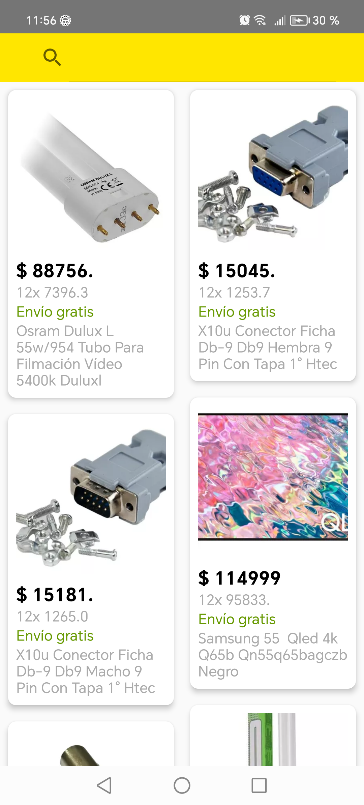

# Prueba android Mercado Libre

# Brayan Eduardo Grosso Fonseca

## DDD Domain Driven Design

[Documentacion Oficial android](https://developer.android.com/topic/architecture/domain-layer?hl=es-419).

## Patron repository

[Documentacion Oficial android](https://developer.android.com/codelabs/basic-android-kotlin-training-repository-pattern?hl=es-419#0).

## Casos de uso

[Documentacion Oficial android](https://developer.android.com/topic/architecture/domain-layer?hl=es-419).

## Capturas

## Dependencias
_androidx.core_

_junit_

_androidx.test.ext_

_androidx.test.espresso_

_androidx.appcompat_

_com.google.android.material_

_androidx.activity_

_androidx.constraintlayout_

_com.google.dagger_

_com.squareup.retrofit2_

_org.jetbrains.kotlinx_

_com.jakewharton.retrofit_

_com.squareup.okhttp3_

_com.google.code.gson_

_com.squareup.retrofit2_

_com.airbnb.android_

_androidx.navigation_
